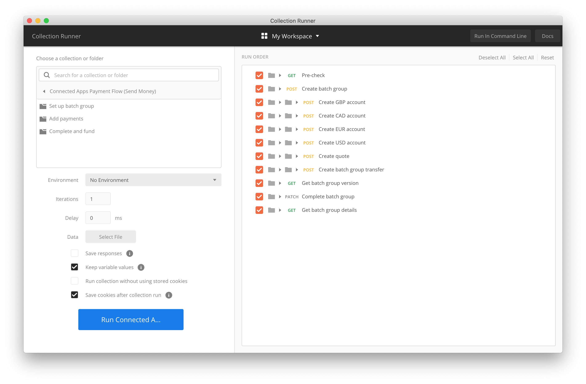

# Connected apps API flow Postman Collections

A set of Postman collections containing the example flows to demonstrate and test the [TransferWise Connected Apps API for partners](https://transferwise.github.io/api-docs-partners/#transferwise-api-connected-applications).

For use with the Postman client, please use the latest version: [download it here](https://www.getpostman.com/).

## Set Up

### Import the Postman collections

Import the `Connected Apps Payment flow (Send Money).postman_collection.json` collection file to Postman

Also import the `TW-API-ENVIRONMENT.postman_environment.json` file, found in the top level of this project, to add the environment variables used to manage your sandbox/production credentials. 

### Set up your Postman environment variables

Set the `client-id`, `client-secret` credentials issued to you by TransferWise.

Use our [oauth flow](https://transferwise.github.io/api-docs-partners/#connected-apps-integration-guide-user-authorization) to generate an authorization code and set this in `client-auth-code`.

### Getting started

The collection is set up to use the Collection Runner. Open with "Runner" and select the collection you imported. It should look something like this:

Make sure the correct Environment is set, and upload the `Connected Apps Payment flow (Send Money).csv` file. Enable "Save responses" to 

Run the collection, a summary will be provided along with a JSON message with the pay-in instructions.

### Funding and waiting for completion

You cannot fund sandbox payments with real money, you must use our [transfer simulation API](https://transferwise.github.io/api-docs-partners/#simulation-simulate-transfer-processing). 
 
To monitor the status of the payments you create, listen to the [transfer state change](https://transferwise.github.io/api-docs-partners/#webhook-events-transfer-status-change-event) webhook using a tool like [webhook.site](https://webhook.site/) to listen for the events. Details on subscribing to webhook events can be found [here](https://transferwise.github.io/api-docs-partners/#application-webhooks).

## Making your own payment data

Our online template instructions tool makes this very easy:

1. Navigate to the [Bank Template instructions](https://transferwise.com/template-instructions/templates/bank-template) page (you will need a TransferWise account)

2. Select your desired source/target currencies and download the template. If you want to set multiple target currencies see [this section](https://transferwise.com/template-instructions/templates/bank-template#multiple-currencies) 

3. Fill in the columns provided, both our API docs and the template instructions page provide information about these fields

## Help

If you need any help using the API please [contact our support team](mailto:api@transferwise.com).
